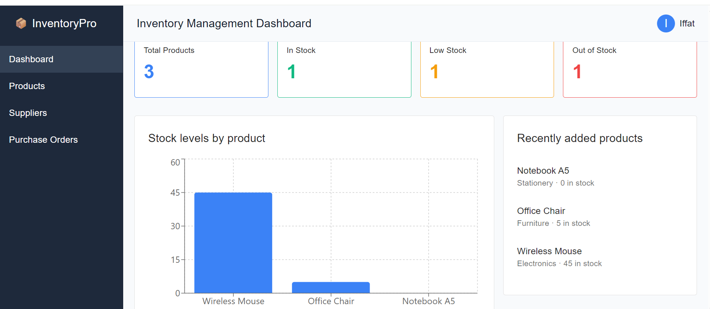
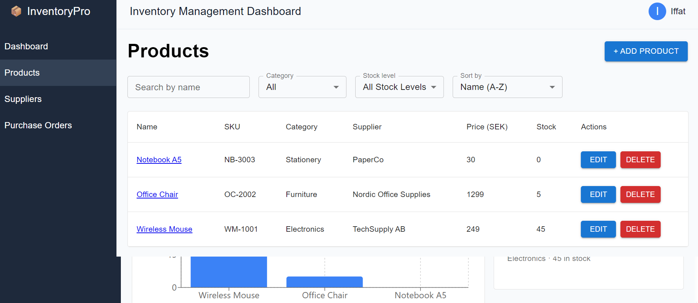
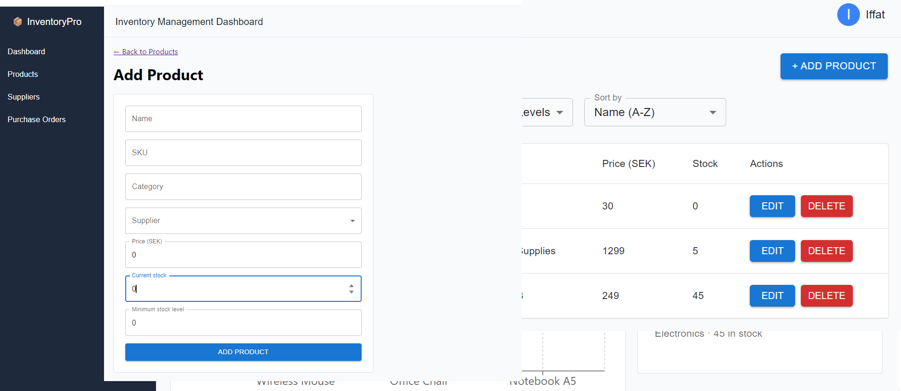
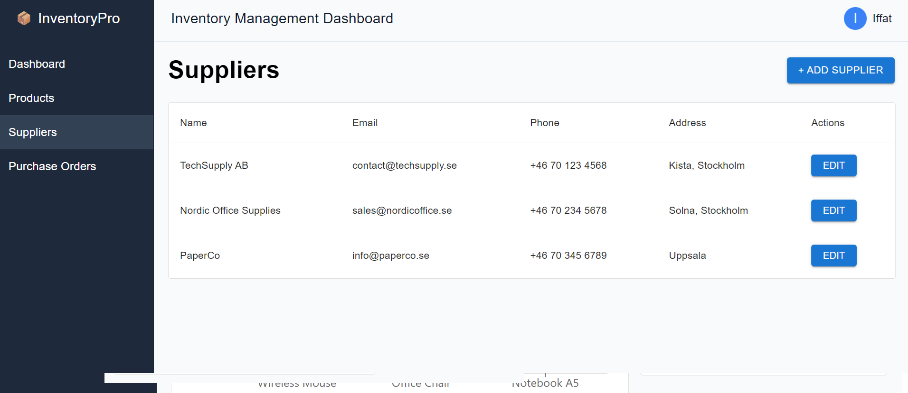
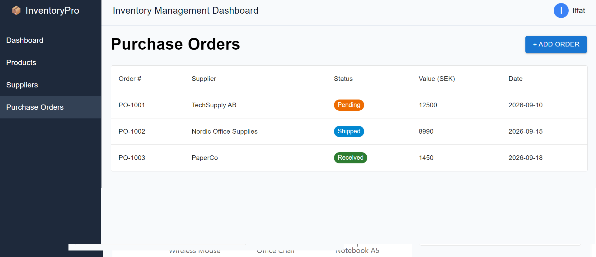

# 📦 Inventory Management Dashboard

[](https://github.com/Iffat-Sudo/inventory-management-dashboard/actions/workflows/ci.yml)

A responsive **frontend inventory management dashboard** designed for small businesses to monitor products, stock levels, suppliers, and purchase orders.

The project is inspired by real-world inventory and supply-chain workflows and focuses on creating a practical, user-friendly business application using modern frontend technologies.

## 🚀 Live Demo

🔗 [https://inventory-management-dashboard-xi.vercel.app](https://inventory-management-dashboard-xi.vercel.app)

## 📸 Screenshots

**Dashboard**


**Products**


**Add Product**


**Suppliers**


**Purchase Orders**


## 🎯 Project Goal

The goal of this project is to build a professional inventory management interface that allows users to:

- Monitor overall inventory status
- View and manage products
- Identify low-stock and out-of-stock products
- Manage suppliers
- Create and manage purchase orders
- Search, filter, and sort inventory data
- View product and stock details

The application is **frontend-only** and currently uses mock/local data (Redux state) to simulate real business data and API responses.

## ✨ Features

### 📊 Dashboard

- Total, in-stock, low-stock, and out-of-stock product counts
- Bar chart of stock levels by product (Recharts)
- Recently added products list

### 📦 Product Management

- View, search, filter, and sort products
- Add, edit, and delete products
- Form validation
- View detailed product information

### 🏢 Supplier Management

- View suppliers
- Add and edit supplier information

### 🚚 Purchase Orders

- View purchase orders
- Create new purchase orders
- Color-coded order status (pending, shipped, received)

### 🔎 User Experience

- Fully responsive design, with a collapsible mobile menu and horizontally scrollable tables on small screens
- Search and filtering
- Form validation
- Empty states
- Confirmation dialogs for deletions

## 🛠️ Technologies

- **React**
- **Vite**
- **TypeScript**
- **Redux Toolkit** (state management)
- **Material UI**
- **React Router**
- **Recharts**
- **Mock data (Redux state)**

## 🏗️ Project Structure

```text
src/
│
├── components/
│   ├── Navbar.tsx
│   ├── Sidebar.tsx
│   ├── StatCard.tsx
│   ├── ProductForm.tsx
│   ├── SupplierForm.tsx
│   └── OrderForm.tsx
│
├── pages/
│   ├── Dashboard/
│   ├── Products/
│   ├── AddProduct/
│   ├── EditProduct/
│   ├── ProductDetails/
│   ├── Suppliers/
│   ├── AddSupplier/
│   ├── EditSupplier/
│   ├── PurchaseOrders/
│   └── AddOrder/
│
├── store/
│   ├── index.ts
│   ├── productsSlice.ts
│   ├── suppliersSlice.ts
│   └── ordersSlice.ts
│
├── App.tsx
└── main.tsx
```

## 💻 Getting Started

### 1. Clone the repository

```bash
git clone https://github.com/Iffat-Sudo/inventory-management-dashboard.git
```

### 2. Navigate to the project

```bash
cd inventory-management-dashboard
```

### 3. Install dependencies

```bash
npm install
```

### 4. Start the development server

```bash
npm run dev
```

The application will be available at the local development URL shown in the terminal.

## 📱 Responsive Design

The application provides a consistent experience across desktop, tablet, and mobile:

- A permanent sidebar on desktop/tablet, replaced by a collapsible mobile drawer on small screens
- Tables scroll horizontally on narrow screens so no data is hidden

## 🔮 Future Improvements

The project is currently frontend-only. Possible future improvements include:

- Connect to a REST API or real backend
- Add authentication and user roles
- Add delete for suppliers and edit for purchase orders
- Add CSV/Excel import and export
- Add notifications for low-stock products

## 📚 What I Practiced

This project focuses on practical frontend development skills, including:

- Building reusable React components with props (forms reused across Add/Edit flows)
- Using TypeScript for type-safe frontend development
- Managing global application state with Redux Toolkit
- Working with forms and validation
- Implementing full CRUD-style interfaces
- Creating responsive, mobile-friendly layouts
- Data visualization with Recharts
- Routing between application pages, including dynamic routes
- Deploying a live application with Vercel
- Setting up a CI pipeline with GitHub Actions (lint and build on every push)

## 👩‍💻 About the Project

This project combines my **frontend development learning** with my previous experience in **supply chain and demand planning**.

The interface is designed around common inventory-management workflows to demonstrate how frontend development can be applied to practical business applications.

---

**Built with React ⚛️ + TypeScript + Redux | Focused on practical frontend development**
